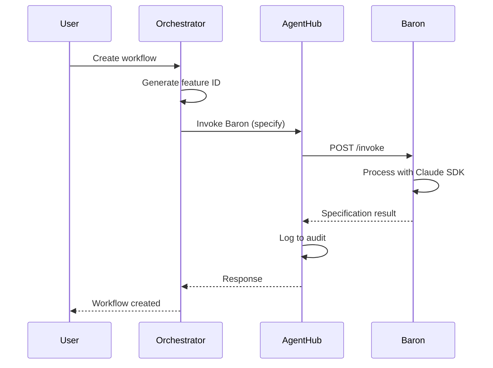
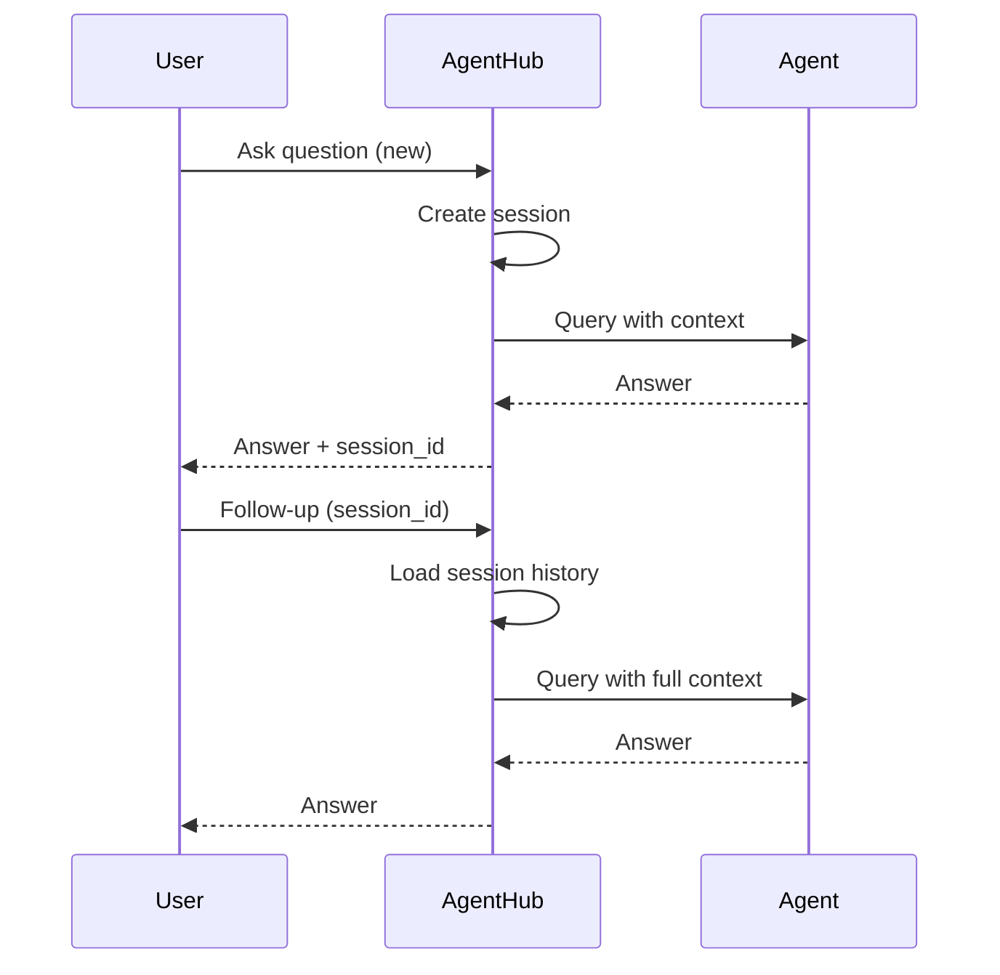
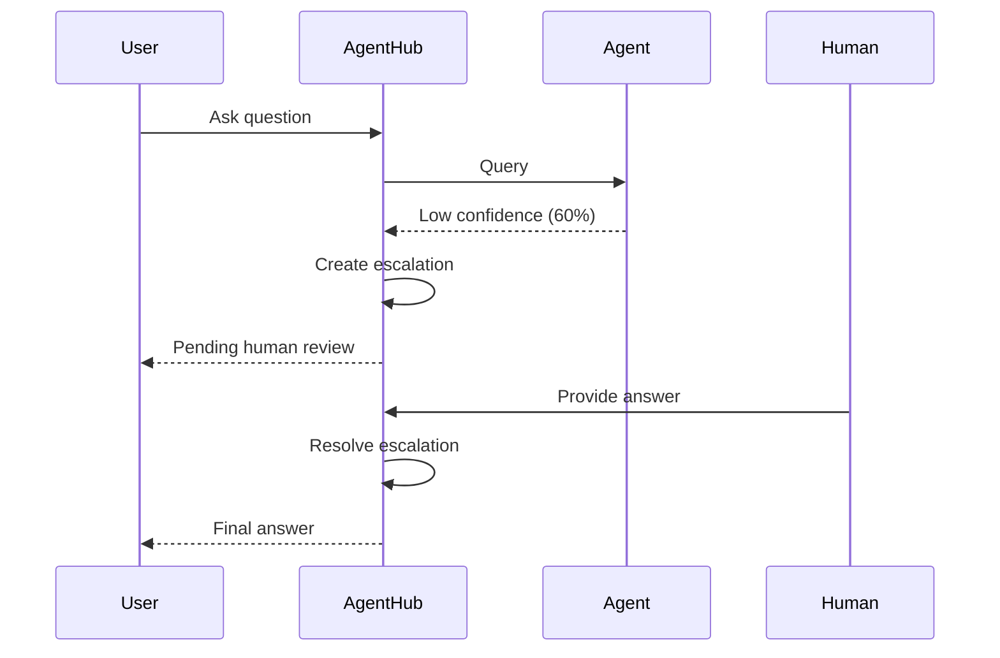

# Data Flow

How data flows through the Farmer Code system.

## Workflow Execution Flow



## Request/Response Models

### Workflow Creation

```json
// Request
{
  "workflow_type": "specify",
  "feature_description": "Add user authentication"
}

// Response
{
  "id": "uuid",
  "feature_id": "009-user-authentication",
  "status": "in_progress"
}
```

### Agent Invocation

```json
// Request to Agent Hub
{
  "workflow_type": "specify",
  "context": {
    "feature_description": "Add user authentication"
  }
}

// Response
{
  "success": true,
  "result": "...",
  "confidence": 85,
  "metadata": {
    "duration_ms": 1500
  }
}
```

## Session Context Flow

For multi-turn conversations:



## Escalation Flow

When confidence is below threshold:


