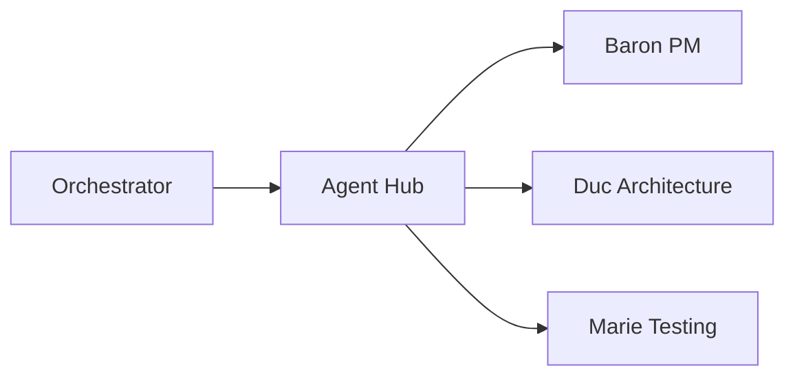

# Farmer Code

AI-powered SDLC automation platform.

## What is Farmer Code?

Farmer Code is a microservices platform that uses AI agents to automate software development lifecycle tasks:

- **Specification Generation** - Generate feature specs from natural language
- **Implementation Planning** - Create detailed implementation plans
- **Task Generation** - Break plans into actionable tasks
- **Expert Consultation** - Ask domain experts (architecture, testing, security)

## Quick Start

```bash
# Clone and install
git clone https://github.com/farmer1st/farmer-code.git
cd farmer-code
uv sync

# Start services
docker-compose up

# Create a workflow
curl -X POST http://localhost:8001/workflows \
  -H "Content-Type: application/json" \
  -d '{"workflow_type": "specify", "feature_description": "Add user authentication"}'
```

[Full Installation Guide](getting-started/installation.md){ .md-button }

## Architecture



| Service | Port | Purpose |
|---------|------|---------|
| Agent Hub | 8000 | Central coordination |
| Orchestrator | 8001 | Workflow state machine |
| Baron | 8010 | PM agent |
| Duc | 8011 | Architecture expert |
| Marie | 8012 | Testing expert |

[Architecture Overview](architecture/index.md){ .md-button }

## Documentation Sections

<div class="grid cards" markdown>

-   :material-rocket-launch: **Getting Started**

    ---

    Installation, quickstart, and development setup.

    [:octicons-arrow-right-24: Get started](getting-started/index.md)

-   :material-sitemap: **Architecture**

    ---

    System design, services, and data flow.

    [:octicons-arrow-right-24: Learn more](architecture/index.md)

-   :material-server: **Services**

    ---

    Individual service documentation.

    [:octicons-arrow-right-24: Explore](services/index.md)

-   :material-book-open: **Guides**

    ---

    How-to guides for common tasks.

    [:octicons-arrow-right-24: Read guides](guides/index.md)

</div>

## Links

- [GitHub Repository](https://github.com/farmer1st/farmer-code)
- [API Reference](reference/api-contracts.md)
- [User Journeys](user-journeys/index.md)
