# Simplified Workflow Architecture (Draft)

**Status:** Draft for review - to be merged into r-and-d-architecture.md
**Version:** 0.5.0-draft

---

## 1. Core Principles

### 1.1 The Two Sources of Truth

| Source | What It Holds | Why |
|--------|---------------|-----|
| **Git** | The work (code, specs, journals) | Commits are immutable, auditable, the actual deliverable |
| **Kubernetes CRD** | The pointer (which phase, which job) | Crash-recoverable, kubectl-editable, no external DB needed |

DynamoDB is **not** in the critical path. It receives fire-and-forget events for analytics and stores deployment records for rollback capability.

### 1.2 Hybrid Infrastructure

| Node Type | Capacity | What Runs Here | Why |
|-----------|----------|----------------|-----|
| **Brain** (Reserved EC2) | Stable, always-on | ARC Listener, Kopf Operator | Never dies, cheap baseline |
| **Muscle** (Spot EC2) | Volatile, scale-to-zero | Orchestrator, Worker Agents | Cost savings, handles interruption |

### 1.3 Asynchronous Polling Pattern

The orchestrator does NOT keep open connections. It uses a **Wake → Dispatch → Poll → Sleep** cycle:

1. **Wake**: Scale agent from 0 → 1 replica
2. **Dispatch**: `POST /jobs` (fire-and-forget, returns immediately)
3. **Poll**: `GET /jobs/{id}` every 5s until `phase: COMPLETED`
4. **Sleep**: Scale agent from 1 → 0 replica (cost savings)

### 1.4 Git Journaling

Each agent writes its results to a journal file in Git. This is the **source of truth** for phase outcomes.

**Location:** `.farmercode/issue-{id}/{agent_name}.json`

The orchestrator reads the journal to determine: advance to next phase, trigger rewind, or escalate to human.

---

## 2. The IssueWorkflow CRD

```yaml
apiVersion: farmercode.io/v1
kind: IssueWorkflow
metadata:
  name: issue-42
  namespace: farmercode          # CRD lives in infra namespace
spec:
  # === CONTEXT ===
  repo: "farmer1st/my-app"
  branch: "feature/42-avatars"
  issueNumber: 42

  # === COST CONTROL ===
  ttlSecondsAfterFinished: 14400  # 4 hours - delete namespace after completion

  # === RESILIENCE ===
  phaseTimeoutSeconds: 28800      # 8 hours - max time for any single phase
  maxRewindCount: 5               # Max REJECT → SPECIFY cycles before human escalation

  # === STATIC WORKFLOW MAP ===
  # Fixed SOP - agents cannot modify this
  phases:
    - name: SPECIFY
      agent: baron
    - name: PLAN
      agent: baron
    - name: TASKS
      agent: baron
    - name: TEST_DESIGN
      agent: marie
    - name: IMPLEMENT_BACKEND
      agent: dede
    - name: IMPLEMENT_FRONTEND
      agent: dali
    - name: IMPLEMENT_GITOPS
      agent: gus
    - name: VERIFY
      agent: marie
      canReject: true             # Can trigger rewind to SPECIFY
    - name: DOCS_QA
      agent: victor
      canReject: true             # Can trigger rewind to SPECIFY
    - name: REVIEW
      agent: general
    - name: MERGE
      agent: general              # Same agent, second task: push & wait for CI
    - name: AWAIT_STAGING
      agent: null                 # Orchestrator hibernates, Town Crier wakes
    - name: RELEASE_STAGING
      agent: vauban
    - name: AWAIT_PROD
      agent: null                 # Orchestrator hibernates, Town Crier wakes
    - name: RELEASE_PROD
      agent: vauban
    - name: RETRO
      agent: socrate

status:
  # === THE POINTER ===
  currentPhaseIndex: 4            # Currently on IMPLEMENT_BACKEND
  state: RUNNING                  # PENDING | RUNNING | AWAITING | COMPLETED | FAILED

  # === JOB TRACKING ===
  currentJobId: "job-uuid-1234"   # Active job ID for polling
  lastOutcome: null               # PASS | REJECT | WAITING_FOR_CI

  # === REWIND TRACKING ===
  rewindCount: 0                  # Number of REJECT → SPECIFY cycles
  lastRejectReason: null          # Why the last rejection happened

  # === DELIVERY TRACKING (for AWAIT states) ===
  delivery:
    targetSha: null               # Commit SHA to verify in environment
    environment: null             # "staging" | "prod"

  # === TIMESTAMPS ===
  startTime: "2026-01-09T10:00:00Z"
  phaseStartTime: "2026-01-09T14:30:00Z"
  finishTime: null

  # === WORKFLOW NAMESPACE ===
  workflowNamespace: fc-issue-42
```

---

## 3. The Orchestrator Loop

The orchestrator is a Python process running `while True`. It does NOT keep open connections. It uses a **Wake → Dispatch → Poll → Sleep** cycle.

### 3.1 The Control Loop Algorithm

```python
class Orchestrator:
    POLL_INTERVAL = 5  # seconds

    async def run(self):
        """Main loop - Wake, Dispatch, Poll, Sleep."""
        while True:
            try:
                await self.tick()
            except Exception as e:
                logger.error(f"Tick failed: {e}")
            await asyncio.sleep(self.POLL_INTERVAL)

    async def tick(self):
        """Single iteration of the orchestrator loop."""
        # 1. READ STATE from CRD
        crd = await self.k8s.get_crd(self.issue_id)

        if crd.status.state in ("COMPLETED", "FAILED"):
            return  # Nothing to do

        phase = crd.spec.phases[crd.status.currentPhaseIndex]

        # 2. Handle AWAIT states (hibernation)
        if phase.name.startswith("AWAIT_"):
            return  # Town Crier will wake us via annotation

        # 3. CHECK JOURNAL (Idempotency)
        # Before waking agent, check if they already finished in a previous life
        journal = await self.git.read_json(
            f".farmercode/issue-{self.issue_id}/{phase.agent}.json"
        )

        if journal and journal["status"]["phase"] == "COMPLETED":
            await self.process_completed_journal(crd, phase, journal)
            return

        # 4. WAKE UP (Scale-to-One)
        if await self.k8s.get_replicas(phase.agent) == 0:
            await self.k8s.scale_deployment(phase.agent, replicas=1)
            await self.wait_for_pod_ready(phase.agent)  # Poll readiness probe

        # 5. DISPATCH (Fire & Forget)
        if not crd.status.currentJobId:
            # Task hasn't started yet - POST /jobs
            try:
                response = await self.http.post(
                    f"http://{phase.agent}/jobs",
                    json=self.build_job_payload(crd, phase, journal)
                )
                job_id = response.json()["job_id"]

                # Update CRD with job ID
                await self.k8s.patch_crd_status(crd.name, {
                    "currentJobId": job_id,
                    "phaseStartTime": datetime.utcnow().isoformat(),
                })
            except ConnectionError:
                # Pod might still be warming up, retry next loop
                logger.debug(f"Agent {phase.agent} not ready, retrying...")
                return

        # 6. POLL (The Watch)
        if crd.status.currentJobId:
            try:
                status = await self.http.get(
                    f"http://{phase.agent}/jobs/{crd.status.currentJobId}"
                )
                status = status.json()

                if status["phase"] == "COMPLETED":
                    # IMMEDIATE SHUTDOWN (Save Money)
                    await self.k8s.scale_deployment(phase.agent, replicas=0)

                    # Read final journal from Git
                    await self.git.pull()
                    journal = await self.git.read_json(
                        f".farmercode/issue-{self.issue_id}/{phase.agent}.json"
                    )
                    await self.process_completed_journal(crd, phase, journal)

            except Timeout:
                # Agent might have crashed - check timeout
                if self.is_phase_timed_out(crd):
                    await self.fail_workflow(crd, f"Phase {phase.name} timed out")

    async def process_completed_journal(self, crd, phase, journal):
        """Handle phase completion based on journal outcome."""
        outcome = journal["status"]["outcome"]

        # Log to DynamoDB (fire-and-forget)
        asyncio.create_task(self.log_phase_completed(crd, phase, journal))

        if outcome == "PASS":
            await self.advance_to_next_phase(crd)

        elif outcome == "REJECT":
            await self.trigger_rewind(crd, journal)

        elif outcome == "WAITING_FOR_CI":
            # Stay in current phase, wait for CI to complete
            pass

    async def trigger_rewind(self, crd, journal):
        """Handle REJECT - rewind to SPECIFY with rejection context."""
        rewind_count = crd.status.rewindCount + 1

        if rewind_count > crd.spec.maxRewindCount:
            # Too many rewinds - escalate to human
            await self.fail_workflow(
                crd,
                f"Max rewind count ({crd.spec.maxRewindCount}) exceeded. "
                f"Last rejection: {journal['status'].get('reject_reason')}"
            )
            return

        # Rewind to SPECIFY (index 0) with rejection as the new "feature"
        await self.k8s.patch_crd_status(crd.name, {
            "currentPhaseIndex": 0,  # Back to SPECIFY
            "currentJobId": None,
            "rewindCount": rewind_count,
            "lastRejectReason": journal["status"].get("reject_reason"),
            "lastOutcome": "REJECT",
            "phaseStartTime": datetime.utcnow().isoformat(),
        })

        logger.info(f"Rewind #{rewind_count}: {journal['status'].get('reject_reason')}")

    async def advance_to_next_phase(self, crd):
        """Move to next phase in the workflow."""
        next_index = crd.status.currentPhaseIndex + 1

        if next_index >= len(crd.spec.phases):
            # Workflow complete
            await self.k8s.patch_crd_status(crd.name, {
                "state": "COMPLETED",
                "currentJobId": None,
                "finishTime": datetime.utcnow().isoformat(),
            })
        else:
            next_phase = crd.spec.phases[next_index]

            # Check if next phase is an AWAIT state
            if next_phase.name.startswith("AWAIT_"):
                await self.k8s.patch_crd_status(crd.name, {
                    "currentPhaseIndex": next_index,
                    "currentJobId": None,
                    "state": "AWAITING",
                    "phaseStartTime": datetime.utcnow().isoformat(),
                })
            else:
                await self.k8s.patch_crd_status(crd.name, {
                    "currentPhaseIndex": next_index,
                    "currentJobId": None,
                    "lastOutcome": "PASS",
                    "phaseStartTime": datetime.utcnow().isoformat(),
                })

    def build_job_payload(self, crd, phase, journal) -> dict:
        """Construct payload for POST /jobs."""
        context = {
            "issue_id": crd.spec.issueNumber,
            "repo": crd.spec.repo,
            "branch": crd.spec.branch,
            "phase": phase.name,
        }

        # If this is a rewind, include rejection context
        if crd.status.lastOutcome == "REJECT":
            context["rewind_context"] = {
                "attempt": crd.status.rewindCount,
                "previous_rejection": crd.status.lastRejectReason,
            }

        return {
            "task_type": phase.name,
            "context": context,
        }

    async def fail_workflow(self, crd, reason: str):
        """Mark workflow as failed - requires human intervention."""
        await self.k8s.patch_crd_status(crd.name, {
            "state": "FAILED",
            "currentJobId": None,
            "finishTime": datetime.utcnow().isoformat(),
            "failureReason": reason,
        })
        asyncio.create_task(self.log_workflow_failed(crd, reason))
```

### 3.2 The Rewind Flow

When Marie (VERIFY) or Victor (DOCS_QA) rejects:

```
┌─────────────────────────────────────────────────────────────────┐
│                        REWIND FLOW                               │
├─────────────────────────────────────────────────────────────────┤
│                                                                  │
│  VERIFY (Marie)                                                  │
│      │                                                           │
│      │ outcome: REJECT                                           │
│      │ reject_reason: "3 tests failed in avatar upload"          │
│      ▼                                                           │
│  Orchestrator                                                    │
│      │                                                           │
│      │ rewindCount < maxRewindCount (5)?                         │
│      │                                                           │
│      ├── YES ──► Reset to SPECIFY (index 0)                      │
│      │           Context: rejection reason becomes the "feature" │
│      │           Baron re-plans with knowledge of what failed    │
│      │                                                           │
│      └── NO ───► FAILED state                                    │
│                  Human must intervene                            │
│                                                                  │
└─────────────────────────────────────────────────────────────────┘
```

---

## 4. The Journal Protocol

The Git journal is the **source of truth** for phase outcomes. Even if an agent pod dies, the journal file persists in Git.

### 4.1 Journal Location

```
.farmercode/
└── issue-{id}/
    ├── baron.json          # Baron's journal (SPECIFY, PLAN, TASKS)
    ├── marie.json          # Marie's journal (TEST_DESIGN, VERIFY)
    ├── dede.json           # Dede's journal (IMPLEMENT_BACKEND)
    ├── dali.json           # Dali's journal (IMPLEMENT_FRONTEND)
    ├── gus.json            # Gus's journal (IMPLEMENT_GITOPS)
    ├── victor.json         # Victor's journal (DOCS_QA)
    ├── general.json        # General's journal (REVIEW, MERGE)
    ├── vauban.json         # Vauban's journal (RELEASE_STAGING, RELEASE_PROD)
    └── socrate.json        # Socrate's journal (RETRO)
```

**Note:** Each agent has ONE journal file that gets updated as they work on different phases. The `meta.phase` field indicates which phase the journal entry is for.

### 4.2 Journal Schema

```json
{
  "meta": {
    "agent": "marie",
    "phase": "VERIFY",
    "job_id": "job-uuid-1234",
    "started_at": "2026-01-09T10:00:00Z",
    "last_updated": "2026-01-09T10:05:30Z"
  },
  "status": {
    "phase": "COMPLETED",        // PENDING | RUNNING | COMPLETED | FAILED
    "outcome": "PASS",           // PENDING | PASS | REJECT | WAITING_FOR_CI
    "reject_reason": null,       // Required if outcome=REJECT
    "error_msg": null            // Required if phase=FAILED
  },
  "context": {
    "trigger_reason": "Verification after IMPLEMENT_BACKEND",
    "rewind_attempt": 0          // Which rewind cycle this is (0 = first attempt)
  },
  "output": {
    "commit_sha": "abc1234",
    "files_modified": ["src/auth.py", "tests/test_auth.py"],
    "metrics": {
      "tests_run": 47,
      "tests_passed": 47,
      "coverage_percent": 87.3
    }
  },
  "logs": [
    { "ts": "10:01:00", "level": "INFO", "msg": "Starting verification..." },
    { "ts": "10:03:00", "level": "THOUGHT", "msg": "All tests passing" },
    { "ts": "10:05:00", "level": "INFO", "msg": "Writing journal entry" }
  ]
}
```

### 4.3 Journal Examples by Outcome

**PASS (Marie - VERIFY):**
```json
{
  "meta": {
    "agent": "marie",
    "phase": "VERIFY",
    "job_id": "job-verify-001",
    "started_at": "2026-01-09T10:00:00Z",
    "last_updated": "2026-01-09T10:05:30Z"
  },
  "status": {
    "phase": "COMPLETED",
    "outcome": "PASS"
  },
  "output": {
    "commit_sha": "abc1234",
    "metrics": {
      "tests_run": 47,
      "tests_passed": 47,
      "tests_failed": 0,
      "coverage_percent": 87.3,
      "lint_errors": 0
    }
  }
}
```

**REJECT (Marie - VERIFY):**
```json
{
  "meta": {
    "agent": "marie",
    "phase": "VERIFY",
    "job_id": "job-verify-002",
    "started_at": "2026-01-09T11:00:00Z",
    "last_updated": "2026-01-09T11:08:00Z"
  },
  "status": {
    "phase": "COMPLETED",
    "outcome": "REJECT",
    "reject_reason": "3 tests failed in avatar upload suite: test_avatar_upload_large_file, test_avatar_upload_invalid_format, test_avatar_resize"
  },
  "output": {
    "commit_sha": "def5678",
    "metrics": {
      "tests_run": 47,
      "tests_passed": 44,
      "tests_failed": 3
    },
    "failed_tests": [
      "test_avatar_upload_large_file",
      "test_avatar_upload_invalid_format",
      "test_avatar_resize"
    ]
  }
}
```

**WAITING_FOR_CI (General - MERGE):**
```json
{
  "meta": {
    "agent": "general",
    "phase": "MERGE",
    "job_id": "job-merge-001",
    "started_at": "2026-01-09T12:00:00Z",
    "last_updated": "2026-01-09T12:02:00Z"
  },
  "status": {
    "phase": "COMPLETED",
    "outcome": "WAITING_FOR_CI"
  },
  "output": {
    "pr_number": 156,
    "merge_commit_sha": "ghi9012",
    "ci_workflow_url": "https://github.com/farmer1st/app/actions/runs/12345"
  }
}
```

**PASS (Vauban - RELEASE_STAGING):**
```json
{
  "meta": {
    "agent": "vauban",
    "phase": "RELEASE_STAGING",
    "job_id": "job-release-staging-001",
    "started_at": "2026-01-09T14:00:00Z",
    "last_updated": "2026-01-09T14:05:00Z"
  },
  "status": {
    "phase": "COMPLETED",
    "outcome": "PASS"
  },
  "output": {
    "environment": "staging",
    "infra_pr_number": 78,
    "target_sha": "jkl3456",
    "overlay_path": "infra/k8s/overlays/staging"
  }
}
```

---

## 5. Agent REST API Contract

Every worker agent (Baron, Dede, Marie, etc.) must implement this strict REST interface.

### 5.1 Endpoint: Start Job

**URL:** `POST /jobs`

**Description:** Triggers the LLM process. Returns immediately (async).

**Request Payload:**
```json
{
  "task_type": "VERIFY",
  "context": {
    "issue_id": 42,
    "repo": "farmer1st/my-app",
    "branch": "feature/42-avatars",
    "phase": "VERIFY",
    "rewind_context": {
      "attempt": 2,
      "previous_rejection": "3 tests failed in avatar upload"
    }
  }
}
```

**Response (202 Accepted):**
```json
{
  "job_id": "job-uuid-1234",
  "status": "PENDING"
}
```

### 5.2 Endpoint: Poll Status

**URL:** `GET /jobs/{job_id}`

**Description:** Returns the current state of the agent's job.

**Response (Running):**
```json
{
  "job_id": "job-uuid-1234",
  "phase": "RUNNING",
  "progress": "Running test suite...",
  "last_updated": "2026-01-09T10:05:00Z"
}
```

**Response (Completed):**
```json
{
  "job_id": "job-uuid-1234",
  "phase": "COMPLETED",
  "outcome": "PASS",
  "result": {
    "files_modified": ["src/auth.py"],
    "commit_sha": "abc1234",
    "journal_entry": "Verification passed. 47 tests, 87% coverage."
  }
}
```

### 5.3 Agent Lifecycle

```python
class AgentWorker:
    """Base class for all worker agents."""

    @app.post("/jobs")
    async def start_job(self, request: JobRequest) -> JobResponse:
        """Accept a job and start processing asynchronously."""
        job_id = str(uuid.uuid4())

        # Initialize journal in PENDING state
        self.journal = {
            "meta": {
                "agent": self.agent_name,
                "phase": request.context["phase"],
                "job_id": job_id,
                "started_at": datetime.utcnow().isoformat(),
            },
            "status": {"phase": "PENDING", "outcome": "PENDING"},
        }

        # Start async processing
        asyncio.create_task(self.process_job(job_id, request))

        return JobResponse(job_id=job_id, status="PENDING")

    @app.get("/jobs/{job_id}")
    async def get_job_status(self, job_id: str) -> JobStatus:
        """Return current job status for orchestrator polling."""
        return JobStatus(
            job_id=job_id,
            phase=self.journal["status"]["phase"],
            outcome=self.journal["status"].get("outcome"),
            progress=self.current_progress,
            last_updated=self.journal["meta"]["last_updated"],
        )

    async def process_job(self, job_id: str, request: JobRequest):
        """Main job processing - runs asynchronously."""
        try:
            # 1. Update status to RUNNING
            self.update_journal(phase="RUNNING")

            # 2. Sync repo
            await self.git.checkout(request.context["branch"])
            await self.git.pull()

            # 3. Execute phase work (LLM inference)
            result = await self.execute_phase(request)

            # 4. Determine outcome
            if result.success:
                outcome = "PASS"
            elif result.needs_rewind:
                outcome = "REJECT"
            else:
                outcome = "WAITING_FOR_CI"

            # 5. Update journal with results
            self.update_journal(
                phase="COMPLETED",
                outcome=outcome,
                reject_reason=result.reject_reason if outcome == "REJECT" else None,
                output=result.to_dict(),
            )

            # 6. Commit journal to Git
            await self.git.add(f".farmercode/issue-{request.context['issue_id']}/{self.agent_name}.json")
            await self.git.commit(
                message=f"[{self.agent_name}] {request.context['phase'].lower()}: {result.summary}"
            )
            await self.git.push()

        except Exception as e:
            self.update_journal(phase="FAILED", error_msg=str(e))
            raise

    def update_journal(self, **kwargs):
        """Update journal and write to disk."""
        self.journal["status"].update(kwargs)
        self.journal["meta"]["last_updated"] = datetime.utcnow().isoformat()
        self.save_journal()
```

### 5.4 Escalation Handling via ARC

Escalations are now handled via **ARC (Actions Runner Controller)**, not internal polling.

```python
async def maybe_escalate(self, question: str, confidence: int) -> str:
    """Post question to GitHub, ARC will notify when human responds."""
    if confidence >= 80:
        return None  # No escalation needed

    # Post to GitHub Issue
    await self.github.post_comment(
        issue=self.issue_number,
        body=f"🤖 **Agent Question** (Confidence: {confidence}%)\n\n{question}\n\n" +
             "Reply to this comment with your answer."
    )

    # Update journal to show we're waiting
    self.update_journal(progress=f"Waiting for human input: {question[:50]}...")

    # ARC will receive the webhook when human responds
    # ARC runner will POST to our /escalation-response endpoint
    response = await self.wait_for_escalation_response(timeout=timedelta(hours=4))

    if response is None:
        # Timeout - fail the phase
        self.update_journal(
            phase="COMPLETED",
            outcome="REJECT",
            reject_reason=f"Escalation timeout: No response to '{question}'"
        )
        return None

    return response.text
```

When a human responds on GitHub:
1. GitHub webhook fires
2. ARC Listener receives webhook on Brain node
3. ARC spawns ephemeral runner on Muscle node
4. Runner identifies correct namespace from issue labels
5. Runner POSTs to `http://{agent}.{namespace}.svc.cluster.local/escalation-response`

---

## 6. Operator Lifecycle Management

The Operator (Kopf) runs on the **Brain Node** and manages CRD lifecycle.

### 6.1 Workflow Creation

```python
import kopf

@kopf.on.create('farmercode.io', 'v1', 'issueworkflows')
async def on_workflow_created(spec, name, namespace, **kwargs):
    """Create ephemeral namespace and deploy pods."""
    workflow_ns = f"fc-{name}"

    # 1. Create namespace
    await k8s.create_namespace(workflow_ns)

    # 2. Create PVC for shared repo
    await k8s.create_pvc(
        name="repo",
        namespace=workflow_ns,
        size="10Gi",
    )

    # 3. Clone repo into PVC (one-time setup)
    await k8s.run_job(
        name="repo-init",
        namespace=workflow_ns,
        image="alpine/git",
        command=["sh", "-c", f"""
            git clone https://github.com/{spec['repo']}.git /repo
            cd /repo
            git checkout {spec['branch']}
        """],
        volume_mounts=[{"name": "repo", "mountPath": "/repo"}],
    )

    # 4. Deploy orchestrator (runs on Muscle node)
    await k8s.deploy(
        name="orchestrator",
        namespace=workflow_ns,
        image="ghcr.io/farmer1st/orchestrator:latest",
        replicas=1,
        node_selector={"role": "muscle"},
        tolerations=[{"key": "spot", "operator": "Equal", "value": "true"}],
        env={
            "ISSUE_ID": name,
            "CRD_NAME": name,
            "CRD_NAMESPACE": namespace,
        },
        resources={"requests": {"cpu": "50m"}},  # Tiny footprint
    )

    # 5. Deploy agents with SCALE-TO-ZERO (replicas=0)
    agents = set(p["agent"] for p in spec["phases"] if p.get("agent"))
    for agent in agents:
        await k8s.deploy(
            name=agent,
            namespace=workflow_ns,
            image=f"ghcr.io/farmer1st/{agent}:latest",
            replicas=0,  # SCALE-TO-ZERO - orchestrator wakes them
            node_selector={"role": "muscle"},
            tolerations=[{"key": "spot", "operator": "Equal", "value": "true"}],
            env={
                "ISSUE_ID": name,
                "AGENT_NAME": agent,
                "REPO_PATH": "/repo",
            },
            volume_mounts=[{"name": "repo", "mountPath": "/repo"}],
            resources={"requests": {"cpu": "1000m"}},  # Beefy for inference
        )

    # 6. Update CRD status
    return {
        "status": {
            "state": "RUNNING",
            "workflowNamespace": workflow_ns,
            "startTime": datetime.utcnow().isoformat(),
            "currentPhaseIndex": 0,
        }
    }
```

### 6.2 Town Crier - Wake-Up Mechanism

When deployment (staging or prod) succeeds, CI runs a "Town Crier" script that pokes the CRD:

```bash
# Town Crier script (runs in CI after successful deployment)
#!/bin/bash
ISSUE_ID=$1
ENVIRONMENT=$2  # "staging" or "prod"

# Poke the CRD to wake up the orchestrator
kubectl annotate issueworkflow issue-${ISSUE_ID} \
    farmercode.io/poke="$(date +%s)" \
    farmercode.io/deployed-env="${ENVIRONMENT}" \
    --overwrite
```

The Operator watches for annotation changes:

```python
@kopf.on.field('farmercode.io', 'v1', 'issueworkflows', field='metadata.annotations')
async def on_annotation_change(old, new, name, namespace, status, **kwargs):
    """Town Crier woke us up - deployment succeeded."""
    poke_time = new.get("farmercode.io/poke")
    deployed_env = new.get("farmercode.io/deployed-env")

    if not poke_time or not deployed_env:
        return

    current_phase = status.get("currentPhaseIndex", 0)
    phases = (await k8s.get_crd(name)).spec.phases

    # Verify we're in the correct AWAIT state
    expected_await = f"AWAIT_{deployed_env.upper()}"
    if phases[current_phase].name != expected_await:
        logger.warning(f"Unexpected poke: at {phases[current_phase].name}, got {deployed_env}")
        return

    # Advance past the AWAIT state
    await k8s.patch_crd_status(name, {
        "currentPhaseIndex": current_phase + 1,
        "state": "RUNNING",
        "phaseStartTime": datetime.utcnow().isoformat(),
    })

    logger.info(f"Town Crier: {name} advancing past {expected_await}")
```

### 6.3 TTL Cleanup

```python
@kopf.timer('farmercode.io', 'v1', 'issueworkflows', interval=300)
async def cleanup_finished_workflows(spec, status, name, **kwargs):
    """Delete namespace after TTL expires."""
    if status.get("state") not in ("COMPLETED", "FAILED"):
        return

    finish_time = datetime.fromisoformat(status["finishTime"])
    ttl = spec.get("ttlSecondsAfterFinished", 14400)

    if datetime.utcnow() > finish_time + timedelta(seconds=ttl):
        workflow_ns = status["workflowNamespace"]
        logger.info(f"TTL expired for {name}, deleting namespace {workflow_ns}")

        # Cascading delete - kills all pods, PVCs, etc.
        await k8s.delete_namespace(workflow_ns)
```

### 6.4 Service Discovery

Since agents scale to zero, their IPs change constantly. We use standard K8s CoreDNS:

**Address pattern:** `http://{agent_name}.{namespace}.svc.cluster.local`

**Example:** `http://dede.fc-issue-42.svc.cluster.local/jobs`

**Resilience:** Orchestrator's HTTP client handles `ConnectionRefused` with exponential backoff (1s, 2s, 4s) while pod starts up.

---

## 7. Architecture Diagram

```mermaid
graph TD
    %% --- GitHub & CI/CD Zone ---
    subgraph GH ["GitHub & CI/CD"]
        Issue["Issue #42<br/>(Label: READY)"]
        PR_Main["PR Merged<br/>to 'main'"]
        InfraRepo["Infra Repo<br/>(ArgoCD Source)"]
        TownCrier["Town Crier<br/>(CI Script)"]
    end

    %% --- Brain Node Zone ---
    subgraph BrainNode ["K8s Brain Node (Reserved EC2)"]
        ARC["ARC Listener"]
        Operator["Kopf Operator"]
    end

    %% --- Muscle Node Zone ---
    subgraph MuscleNode ["K8s Muscle Node (Spot EC2)"]
        Runner["ARC Runner<br/>(Ephemeral)"]
        Orch["Orchestrator Pod"]

        subgraph Workers ["Worker Agents (Scale-to-Zero)"]
            Baron["Baron"]
            DedeDali["Dede/Dali"]
            Marie["Marie"]
            Victor["Victor"]
            General["General"]
            Vauban["Vauban"]
            Socrate["Socrate"]
        end
    end

    %% --- Targets Zone ---
    subgraph Targets ["Environments"]
        DevEnv[("Dev")]
        StagingEnv[("Staging")]
        ProdEnv[("Prod")]
    end

    %% --- The Flow ---
    Human((Human)) -->|Label: READY| Issue
    Issue -->|Webhook| ARC
    ARC -->|Spawns| Runner
    Runner -->|kubectl apply| Operator
    Operator -->|Creates NS + Pods| Orch

    Orch -->|Scale 0→1, POST /jobs| Baron
    Baron -->|outcome: PASS| Orch
    Orch -->|Scale 0→1, POST /jobs| DedeDali
    DedeDali -->|outcome: PASS| Orch
    Orch -->|Scale 0→1, POST /jobs| Marie
    Marie -->|outcome: REJECT| Orch
    Orch -->|Rewind to SPECIFY| Baron
    Marie -->|outcome: PASS| Orch
    Orch -->|Scale 0→1, POST /jobs| Victor
    Victor -->|outcome: PASS| Orch
    Orch -->|Scale 0→1, POST /jobs| General
    General -->|Merge PR| PR_Main
    PR_Main -->|ArgoCD Sync| DevEnv

    Orch -->|Scale 0→1, POST /jobs| Vauban
    Vauban -->|Update YAML| InfraRepo
    InfraRepo -->|ArgoCD Sync| StagingEnv
    StagingEnv -->|Success| TownCrier
    TownCrier -->|kubectl annotate| Operator
    Operator -->|Wake| Orch

    Vauban -->|Update YAML| InfraRepo
    InfraRepo -->|ArgoCD Sync| ProdEnv
    ProdEnv -->|Success| TownCrier
    TownCrier -->|kubectl annotate| Operator
    Operator -->|Wake| Orch

    Orch -->|Scale 0→1, POST /jobs| Socrate
    Socrate -->|Close Issue| Issue
```



### 7.1 Sequence: Normal Phase

```
Orchestrator                Agent (e.g., Dede)
     │                              │
     │  1. Scale 0→1                │
     │─────────────────────────────>│
     │                              │
     │  2. POST /jobs               │
     │─────────────────────────────>│
     │      {task_type, context}    │ (202 Accepted, job_id)
     │<─────────────────────────────│
     │                              │
     │  3. GET /jobs/{id} (poll)    │
     │─────────────────────────────>│
     │      {phase: RUNNING}        │
     │<─────────────────────────────│
     │                              │
     │  ... (repeat every 5s) ...   │
     │                              │
     │  4. GET /jobs/{id}           │
     │─────────────────────────────>│
     │      {phase: COMPLETED,      │
     │       outcome: PASS}         │
     │<─────────────────────────────│
     │                              │
     │  5. Scale 1→0                │
     │─────────────────────────────>│
     │                              │
     │  6. git pull, read journal   │
     │  7. Advance phase index      │
     │                              │
```

### 7.2 Sequence: Rewind (REJECT)

```
Orchestrator                Marie (VERIFY)           Baron (SPECIFY)
     │                          │                          │
     │  GET /jobs/{id}          │                          │
     │─────────────────────────>│                          │
     │  {outcome: REJECT,       │                          │
     │   reject_reason: "..."}  │                          │
     │<─────────────────────────│                          │
     │                          │                          │
     │  Scale Marie 1→0         │                          │
     │─────────────────────────>│                          │
     │                          │                          │
     │  Reset phaseIndex=0      │                          │
     │  rewindCount++           │                          │
     │                          │                          │
     │  Scale Baron 0→1         │                          │
     │─────────────────────────────────────────────────────>│
     │                          │                          │
     │  POST /jobs              │                          │
     │  {context: {             │                          │
     │    rewind_context: {     │                          │
     │      attempt: 1,         │                          │
     │      previous_rejection: │                          │
     │        "3 tests failed"  │                          │
     │    }                     │                          │
     │  }}                      │                          │
     │─────────────────────────────────────────────────────>│
     │                          │                          │
```

### 7.3 Sequence: Town Crier Wake-Up

```
CI (Town Crier)         Operator (Brain)        Orchestrator (Muscle)
     │                        │                        │
     │  kubectl annotate      │                        │
     │  farmercode.io/poke=.. │                        │
     │───────────────────────>│                        │
     │                        │                        │
     │                        │  Watch: annotation     │
     │                        │  changed               │
     │                        │                        │
     │                        │  Patch CRD:            │
     │                        │  phaseIndex++          │
     │                        │  state: RUNNING        │
     │                        │───────────────────────>│
     │                        │                        │
     │                        │                        │  (next tick)
     │                        │                        │  Resume workflow
     │                        │                        │
```

---

## 8. Architecture Decision Records (ADRs)

### ADR-001: Git-Driven State Machine

**Decision:** Use Git commits as phase completion signals, CRD status as the pointer.

**Context:** Need to track workflow progress through multi-step SDLC phases.

**Rationale:**
- Git IS the source of truth for software development
- Commits are immutable, auditable, already versioned
- CRD status survives orchestrator crashes (Kubernetes guarantees)
- `kubectl edit` for manual intervention is intuitive for ops
- No external workflow engine to operate (Temporal requires complex cluster)

**Trade-offs:**
- Less flexible than Temporal for complex branching workflows
- Journal protocol adds convention that agents must follow

---

### ADR-002: ARC Webhooks for Workflow Trigger, Polling for Phase Completion

**Decision:** Use ARC (Actions Runner Controller) webhooks to trigger workflows; use internal polling (`GET /jobs/{id}`) for phase completion.

**Context:** Need to trigger workflows from GitHub and detect when agents complete their work.

**Rationale:**
- **ARC for workflow trigger:** GitHub webhook → ARC Listener → Ephemeral Runner → `kubectl apply` CRD
- **Polling for agent status:** Orchestrator polls agent's REST endpoint every 5s
- **No external dependencies:** Once workflow starts, all communication is internal K8s
- **Simpler agent contract:** Agents just implement `/jobs` REST API, no webhook setup

**Trade-offs:**
- Requires ARC infrastructure on Brain node
- 5s polling latency is acceptable for phase completion (minutes-long operations)

---

### ADR-003: CRD for Execution, DynamoDB for Analytics

**Decision:** Execution state in CRD, rich history in DynamoDB (fire-and-forget).

**Context:** Need to persist workflow state and collect data for learning.

**Rationale:**
- **Decoupled failure domains:** Workflow doesn't fail if DynamoDB is down
- **etcd is highly available:** CRD status is the "save game"
- **DynamoDB for queries:** Retro agent needs rich history, deployment records need querying for rollback

**Trade-offs:**
- DynamoDB data could be lost if fire-and-forget fails (acceptable for analytics)
- Deployment records in DynamoDB are critical for rollback (not fire-and-forget for those)

---

### ADR-004: One Commit Per Phase

**Decision:** Each phase produces exactly one atomic commit with a journal file.

**Context:** Orchestrator needs to know when a phase is complete and its result.

**Rationale:**
- **Clear completion signal:** Commit exists = phase attempted
- **Structured results:** Journal JSON tells success/fail/skip
- **Auditable:** Every phase result is in Git history
- **Simple orchestrator:** Just poll for commits, read journal

**Trade-offs:**
- Agents must follow the journal protocol strictly
- Large phases might naturally want multiple commits (mitigated by using git squash or single final commit)

---

### ADR-005: Namespace-per-Issue with TTL Cleanup

**Decision:** Ephemeral namespace `fc-{issue-id}` with automatic TTL deletion.

**Context:** Need isolation between concurrent features and cost control.

**Rationale:**
- **Simple DNS:** Agents call `http://baron:8002` (namespace-scoped)
- **Hard isolation:** No cross-feature interference
- **Guaranteed cleanup:** Namespace deletion cascades to all resources
- **Cost control:** TTL prevents zombie resources

**Trade-offs:**
- More namespaces to manage (mitigated by automation)
- Slight overhead per namespace (acceptable)

---

### ADR-006: Escalations via ARC

**Decision:** Agents post questions to GitHub; ARC delivers human responses back to agents.

**Context:** Agents sometimes need human input during their work.

**Rationale:**
- **Simpler orchestrator:** Orchestrator is unaware of escalations, just sees longer phase duration
- **ARC for delivery:** Human replies trigger GitHub webhook → ARC → Runner → POST to agent
- **Agent autonomy:** Agent decides when/how to escalate based on confidence score
- **Timeout handling:** Phase timeout covers escalation timeout
- **Journal records escalations:** Full audit trail in Git

**Trade-offs:**
- Requires ARC to handle issue_comment webhooks
- Long-running phases might look "stuck" to observers (mitigated by progress updates in journal)

---

### ADR-007: Self-Healing Rewind

**Decision:** When verification fails (REJECT), automatically rewind to SPECIFY phase with rejection context.

**Context:** Need to handle test failures and review rejections without human intervention.

**Rationale:**
- **Autonomous recovery:** System attempts to fix issues itself up to `maxRewindCount` (default: 5)
- **Context preservation:** Rejection reason becomes the "feature" for Baron to re-plan
- **Clear escalation path:** After max rewinds, workflow FAILS and human must intervene
- **Learning opportunity:** Each rewind attempt is logged for Socrate's retrospective analysis

**Implementation:**
```python
if outcome == "REJECT":
    if rewind_count < max_rewind_count:
        # Rewind to SPECIFY with context
        crd.status.currentPhaseIndex = 0
        crd.status.lastRejectReason = journal["status"]["reject_reason"]
    else:
        # Escalate to human
        crd.status.state = "FAILED"
```

**Trade-offs:**
- May waste compute on repeated failures (mitigated by rewind limit)
- Rejection reason must be descriptive enough for Baron to understand

---

### ADR-008: Shared Repo Directory (No Git Worktrees)

**Decision:** All agents share a single cloned repo directory on a shared PVC. No git worktrees.

**Context:** Git worktrees allow multiple branches to be checked out simultaneously from a single repo. Originally considered for concurrent agent work.

**Rationale:**
- **Sequential model eliminates need:** Only one agent works at a time per workflow. When agent A finishes, agent B takes over. No concurrent branch access needed.
- **Simpler git operations:** Just `git pull` → work → `git commit` → `git push`
- **No worktree limitations:** Git worktrees have constraints:
  - Same branch cannot be checked out in two worktrees simultaneously
  - Concurrent writes to same branch cause conflicts
  - Index/reflog shared across worktrees can cause race conditions
- **Reduced storage:** Single repo clone vs. multiple worktrees
- **Faster cold start:** No worktree creation overhead

**Implementation:**
```python
# Before each phase:
await git.checkout(branch)
await git.pull()

# After phase work:
await git.add_all()
await git.commit(message="...")
await git.push()
```

**Trade-offs:**
- If we ever need parallel agents on same branch → would need to revisit (but sequential model is deliberate)
- Repo must be cloned once at namespace creation (handled by orchestrator init)

---

### ADR-009: Scale-to-Zero Agents

**Decision:** Deploy agents with `replicas=0`; orchestrator scales to 1 before dispatch, back to 0 after completion.

**Context:** Need to minimize cost of idle agent pods on Spot instances.

**Rationale:**
- **Cost savings:** Agents only consume resources when actively working
- **Simple scaling:** K8s handles pod lifecycle; orchestrator just calls `scale()`
- **Cold start acceptable:** Agent inference takes minutes; 10-30s pod startup is negligible
- **Spot-friendly:** Fewer long-running pods = fewer interruption risks

**Implementation:**
```python
# Before dispatch
if k8s.get_replicas(agent) == 0:
    k8s.scale_deployment(agent, replicas=1)
    wait_for_pod_ready(agent)

# After completion
k8s.scale_deployment(agent, replicas=0)  # Immediate shutdown
```

**Trade-offs:**
- Cold start latency (mitigated by fast container images)
- Service discovery complexity (mitigated by K8s DNS + retry logic)

---

### ADR-010: Town Crier for Deployment Verification

**Decision:** Use CI-triggered K8s annotation ("Town Crier") to wake orchestrator after deployment succeeds.

**Context:** After releasing to staging/prod, orchestrator needs to know deployment succeeded.

**Rationale:**
- **Decoupled verification:** CI verifies deployment, not orchestrator
- **No polling external systems:** Orchestrator hibernates in AWAIT state, not polling ArgoCD
- **Simple signal mechanism:** K8s annotation change triggers Kopf handler
- **Works with any CD:** ArgoCD, Flux, or manual deploys can all call Town Crier script

**Implementation:**
```bash
# Town Crier (runs in CI after deployment success)
kubectl annotate issueworkflow issue-${ID} \
    farmercode.io/poke="$(date +%s)" \
    farmercode.io/deployed-env="staging"
```

**Trade-offs:**
- Requires CI access to K8s cluster (service account with limited RBAC)
- If Town Crier fails, workflow stays in AWAIT (timeout eventually triggers FAILED)

---

### ADR-011: Brain/Muscle Node Separation

**Decision:** Run stable components (Operator, ARC) on Reserved "Brain" nodes; run volatile components (Orchestrator, Agents) on Spot "Muscle" nodes.

**Context:** Need to balance cost optimization with reliability.

**Rationale:**
- **Brain (Reserved EC2):** Always-on, never interrupted. Runs Kopf Operator, ARC Listener.
- **Muscle (Spot EC2):** 70-90% cost savings. Runs Orchestrators, Agents.
- **Resilience:** CRD state survives Spot interruptions; orchestrator restarts and resumes
- **Cost efficiency:** Most compute-heavy work (LLM inference) runs on cheap Spot

**Node Affinity:**
```yaml
# Brain pods
nodeSelector: { role: "brain" }

# Muscle pods
nodeSelector: { role: "muscle" }
tolerations: [{ key: "spot", operator: "Equal", value: "true" }]
```

**Trade-offs:**
- Requires node pool management in EKS
- Spot interruptions may cause phase restarts (mitigated by journal checkpointing)

---

## 9. What's NOT in This Model

These features are explicitly deferred or removed:

| Feature | Status | Rationale |
|---------|--------|-----------|
| Event sourcing in DynamoDB | Removed | CRD + Git journal is sufficient |
| Complex escalation state machine | Removed | ARC webhook handles it simply |
| Workflow-as-data (editable phases) | Removed | Static SOP is safer |
| Parallel agents on same branch | Not supported | Sequential model by design |
| Git worktrees | Not needed | Sequential model - one agent at a time |
| A2A JSON-RPC protocol | Replaced | REST `/jobs` API is simpler |
| GitHub polling for human responses | Replaced | ARC webhooks are faster |

---

## 10. Summary

### Key Design Principles

1. **Git is the source of truth** - Journal files in `.farmercode/` are the canonical record
2. **CRD is the state pointer** - Crash-recoverable, kubectl-editable
3. **Scale-to-zero for cost** - Agents only run when actively working
4. **Self-healing rewind** - Up to 5 automatic retry cycles before human escalation
5. **Town Crier for async signals** - CI pokes K8s annotation to wake hibernating workflows
6. **Brain/Muscle separation** - Stable infrastructure on Reserved, volatile workloads on Spot

### Phase Flow

```
SPECIFY → PLAN → TASKS → TEST_DESIGN → IMPLEMENT_* → VERIFY → DOCS_QA
    ↑                                                    │
    └────────────── REJECT (rewind) ─────────────────────┘

→ REVIEW → MERGE → [DEV auto-deploy] → RELEASE_STAGING → AWAIT_STAGING
→ RELEASE_PROD → AWAIT_PROD → RETRO → COMPLETED
```

### Checklist for Implementation

- [ ] Implement `/jobs` REST API in all agents
- [ ] Create IssueWorkflow CRD schema
- [ ] Build Kopf Operator with Town Crier handler
- [ ] Set up ARC on Brain node
- [ ] Configure node pools (brain/muscle)
- [ ] Create Town Crier CI script
- [ ] Implement journal protocol in agents
- [ ] Add rewind logic to orchestrator
